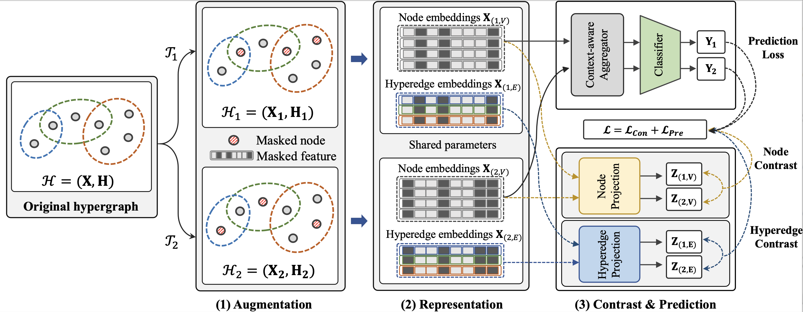

# [SIGIR'23] DASH: Dual Self-Supervised Learning for Hyperedge Prediction
This repository provides an implementation of *DASH* as described in the paper: 

## The overview of KHAN


- **Datasets**
    - We present two important research questions: (**Q1**) how to fully exploit group information for hyperedge prediction? and (**Q2**) how to aggregate the nodes of a hyperedge candidate?
- **Method**
    - We propose a novel approach to hyperedge prediction, DASH that employs (1) _dual_ contrastive learning equipped with a _hyperedge-aware_ augmentation method for Q1 and (2) a _context-aware_ node aggregation strategy for Q2.
- Evaluation
    - Via extensive experiments using 4 real hypergraphs, we demonstrate the superiority of DASH over existing methods.


## Datasets
All datasets used in the paper are available at [Here](https://drive.google.com/drive/folders/1w1zpGfQ1Sgl3A0fIlP4ekrDvSZ9Af1YT?usp=share_link).

|Name|#Nodes|#Edges|Domain|
|:---:|:---:|:---:|:---:|
|Citeseer|1,457|1,078|Co-citation|
|Cora|1,434|1,579|Co-citation|
|Cora-A|2,388|1,072|Authorship|
|Pubmed|3,840|7,962|Co-citation|


### Dataset format
Each dataset file contains following keys: 'N_edges', 'N_nodes', 'NodeEdgePair', 'EdgeNodePair', 'nodewt', 'edgewt', 'node_feat'.
We also provide preprocessed splits, each of which contains train, validation, and test sets (both positive and negative).
They can be found in ```split/``` in the provided link above.


## Dependencies
Our code runs on the Intel i7-9700k CPU with 64GB memory and NVIDIA RTX 2080 Ti GPU with 12GB, with the following packages installed:
```
python 3.8.10
torch 1.11.0
dgl 0.9.0
numpy
argparse
sklearn
```

## How to run (example)
```
python3 -u run.py \
    --gpu_index=0 \
    --batch_size=32 \
    --ns_method=SNS \
    --h_dim=256 \
    --proj_dim=256 \
    --drop_feature_rate=0.2 \
    --drop_incidence_rate=0.4 \
    --num_epochs=200 \
    --dataset=citeseer \
    --learning_rate=0.005 \

```
