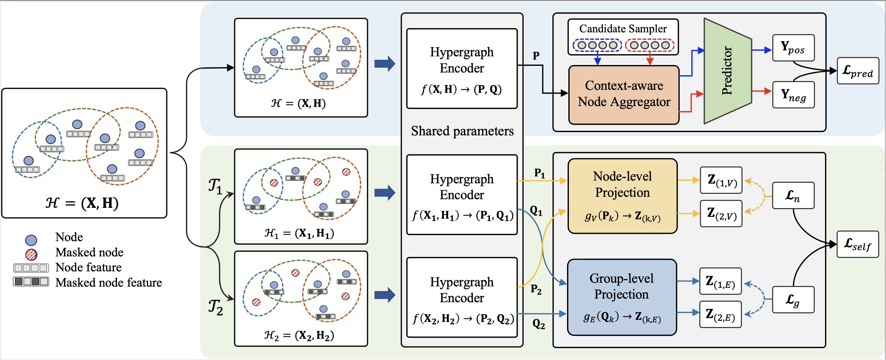

# [Enhancing Hyperedge Prediction with Context-Aware Self-Supervised Learning (IEEE TKDE)(https://arxiv.org/abs/2309.05798)
Authors: Yunyong Ko, Hanghang Tong, and Sang-Wook Kim.\
This repository provides an implementation of *CASH*. 

## The overview of CASH


- **Important Challenges**
    - We point out two important but under-explored challenges of hyperedge prediction: **(C1)** the node aggregation of a hyperedge candidate and **(C2)** the data sparsity.
- **Effective Framework**
    - We propose a novel hyperedge prediction framework, CASH that employs (1) a _context-aware node aggregation_ for C1 and (2) _self-supervised learning_ equipped with _hyperedge-aware augmentation_ and _dual contrastive loss_ for C2.
- **Extensive Evaluation**
    - We conduct extensive evaluation, which verifies the superiority of CASH in terms of (1) accuracy, (2) effectiveness, (3) insensitivity, and (4) scalability.


## Datasets
All datasets used in the paper are available at [Link](https://drive.google.com/drive/folders/1w1zpGfQ1Sgl3A0fIlP4ekrDvSZ9Af1YT?usp=share_link).

|Name|#Nodes|#Edges|#Features|Domain|
|:---:|:---:|:---:|:---:|:---:|
|Citeseer|1,457|1,078|3703|Co-citation|
|Cora|1,434|1,579|1433|Co-citation|
|Pubmed|3,840|7,962|500|Co-citation|
|Cora-A|2,388|1,072|1433|Authorship|
|DBLP-A|39,283|16,483|4543|Authorship|
|DBLP|2,388|22,964|4543|Collaboration|


### Dataset format
Each dataset file contains following keys: 'N_edges', 'N_nodes', 'NodeEdgePair', 'EdgeNodePair', 'nodewt', 'edgewt', 'node_feat'.
We also provide preprocessed splits, each of which contains train, validation, and test sets (both positive and negative).


## Dependencies
Our code runs on the Intel i7-9700k CPU with 64GB memory and NVIDIA RTX 2080 Ti GPU with 12GB, with the following packages installed:
```
python 3.8.10
torch 1.11.0
dgl 0.9.0
numpy
argparse
sklearn
```

## How to run (example)
```
python3 -u run.py \
    --gpu_index=0 \
    --batch_size=32 \
    --ns_method=SNS \
    --h_dim=512 \
    --proj_dim=512 \
    --drop_feature_rate=0.24 \
    --drop_incidence_rate=0.4 \
    --num_epochs=200 \
    --dataset=citeseer \
    --learning_rate=0.005 \
```


## Citation
Please cite our paper if you have used the code in your work. You can use the following BibTex citation:
```
@article{ko2025enhancing,
  title={Enhancing hyperedge prediction with context-aware self-supervised learning},
  author={Ko, Yunyong and Tong, Hanghang and Kim, Sang-Wook},
  journal={IEEE Transactions on Knowledge and Data Engineering},
  year={2025},
  publisher={IEEE}
}
